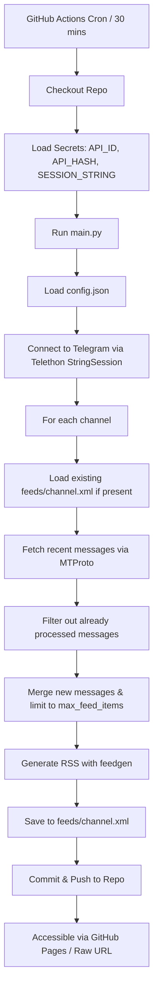

# Plan: Telegram to RSS Feed Generator (Using Telethon Client API)

This plan outlines the design and implementation of a Python-based tool that uses the official Telegram Client API (MTProto) via the `Telethon` library to fetch recent posts from public Telegram channels, converts them into individual RSS feeds, and runs automatically every 30 minutes via GitHub Actions. The generated RSS feeds will be committed back to the repository, making them publicly accessible.

## 1. Architecture & Design

### 1.1 Telegram API Integration
We will use the official Telegram Client API (MTProto) via the **Telethon** library. This is much more reliable than web scraping, as it is not subject to web-scraping rate limits, Cloudflare challenges, or HTML structure changes.

To run Telethon in a stateless environment like GitHub Actions:
1. **API Credentials**: The user will need to obtain `API_ID` and `API_HASH` from [my.telegram.org](https://my.telegram.org/).
2. **Authentication Session**: We will use Telethon's `StringSession`. This allows us to authenticate once locally, generate a single session string, and store it as a GitHub Secret. The GitHub Actions workflow will load this string at runtime, avoiding the need for interactive login or persisting a `.session` file.
3. **Secrets Management**: `TELEGRAM_API_ID`, `TELEGRAM_API_HASH`, and `TELEGRAM_SESSION_STRING` will be stored securely as GitHub Repository Secrets.

### 1.2 Incremental Feed Updates & Deduplication
To handle which messages are new and which have already been processed, the script will implement an incremental update strategy:
1. **Load Existing Feed**: For each channel, the script will check if `feeds/<channel_name>.xml` already exists. If it does, the script will parse the existing XML file to extract the IDs/URLs of already processed messages.
2. **Fetch Latest Messages**: Fetch the most recent messages (e.g., last 10 messages) from the Telegram channel.
3. **Deduplicate**: Compare the fetched messages against the already processed message IDs/URLs. Only messages that are *not* in the existing feed will be treated as new.
4. **Merge & Limit**:
   - Add the new messages to the feed.
   - Keep the feed sorted by publication date (newest first).
   - Limit the total number of items in the feed (e.g., max 100 items) to prevent the XML file from growing indefinitely while preserving history.
5. **Save**: Write the updated feed back to `feeds/<channel_name>.xml`.

### 1.3 Storage & Hosting
- The generated RSS feeds will be saved in a `feeds/` directory in the repository.
- A GitHub Actions workflow will commit and push these files back to the repository.
- The feeds will be accessible via:
  - GitHub Pages (e.g., `https://<username>.github.io/<repo>/feeds/<channel_name>.xml`)
  - Or raw GitHub URLs (e.g., `https://raw.githubusercontent.com/<username>/<repo>/main/feeds/<channel_name>.xml`)

### 1.4 Configuration
We will use a simple `config.json` file to manage the list of channels and feed settings:
```json
{
  "channels": [
    "telegram",
    "durov"
  ],
  "max_feed_items": 100
}
```

---

## 2. Implementation Steps

### Step 1: Project Setup & Configuration
- Create `config.json` to store the list of target Telegram channels and the maximum number of items per feed.
- Create `requirements.txt` with necessary dependencies:
  - `telethon`
  - `feedgen`
  - `lxml` (for faster XML generation and parsing)

### Step 2: Session Generation Utility
- Create a helper script `generate_session.py` to run locally once. It will prompt the user for their `API_ID`, `API_HASH`, and phone number, perform the login, and print the `StringSession` string. The user will save this string as a GitHub Secret.

### Step 3: Feed Generator Script
- Implement the main Python script `main.py` that:
  - Loads `config.json`.
  - Initializes the `TelegramClient` using the `StringSession` and API credentials from environment variables.
  - For each channel:
    - Checks if `feeds/<channel_name>.xml` exists. If so, parses it to extract existing item IDs.
    - Fetches the channel entity.
    - Retrieves the last N messages (e.g., 10 messages).
    - Filters out messages that are already present in the existing feed.
    - Parses each new message (text, date, media, message ID to construct the direct link `https://t.me/channel/id`).
    - Appends new items to the feed using `feedgen`.
    - Truncates the feed to `max_feed_items` if it exceeds the limit.
    - Saves the feed to `feeds/<channel_name>.xml`.

### Step 4: GitHub Actions Workflow
- Create `.github/workflows/update_feeds.yml` configured to:
  - Run on a cron schedule: `*/30 * * * *` (every 30 minutes).
  - Run on `workflow_dispatch` (manual trigger).
  - Check out the repository.
  - Set up Python.
  - Install dependencies from `requirements.txt`.
  - Run `main.py` with environment variables populated from GitHub Secrets:
    - `TELEGRAM_API_ID`
    - `TELEGRAM_API_HASH`
    - `TELEGRAM_SESSION_STRING`
  - Configure git, commit any changes in the `feeds/` directory, and push them back to the repository.

### Step 5: Testing & Verification
- Run the session generator locally to obtain the session string.
- Run the main script locally using the session string to verify feed generation.
- Verify that the generated XML files are valid RSS feeds.
- Test the GitHub Actions workflow to ensure it runs successfully and commits the feeds.

---

## 3. Mermaid Diagram: Workflow


